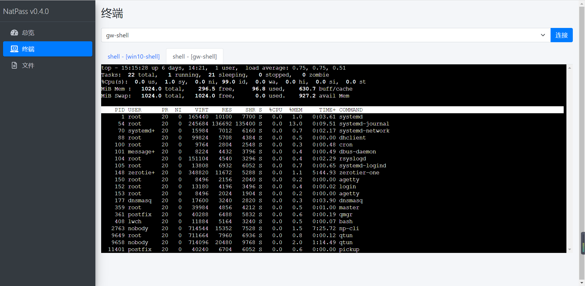
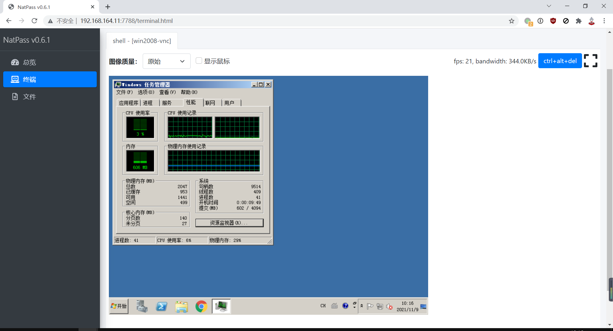
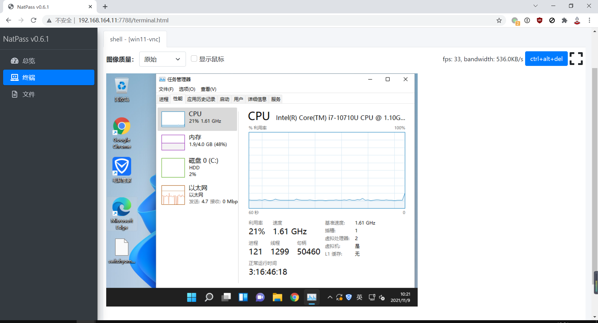

# natpass

新一代主机管理工具，支持shell管理，支持远程桌面管理[实现原理](docs/desc.md)

1. [如何部署](docs/startup.md)
2. [规则配置](docs/rules.md)

功能与特性：

1. 较小的内存占用（约20M左右）
2. 支持tls安全连接
3. 支持多路异步IO
4. 支持虚拟链路层
5. 支持链路和终端会话监控
6. 支持web shell
7. 支持web vnc
8. 支持多种操作系统
9. protobuf数据编码

## 效果图

dashboard页面

linux命令行效果

windows命令行效果

windows2008远程桌面

windows10远程桌面

windows11远程桌面

## TODO

1. ~~支持include的yaml配置文件~~
2. ~~通用的connect、connect_response、disconnect消息~~
3. ~~dashboard页面~~
4. 文件传输
5. ~web远程桌面~
6. ~~流量监控统计页面，server还是client?~~
7. web端管理规则
8. 支持录屏

## stars

## 免责声明

本软件仅用于个人研究学习，包括但不限于以下条款：

1. 严禁用于黑客攻击、远程控制他人计算机等违法违规行为
2. 软件使用者使用该软件造成的任何损失均与软件作者无关，
   一切后果由使用者自己负责
3. 严禁用于一切商业用途，包括但不限于提供云桌面、云主机等