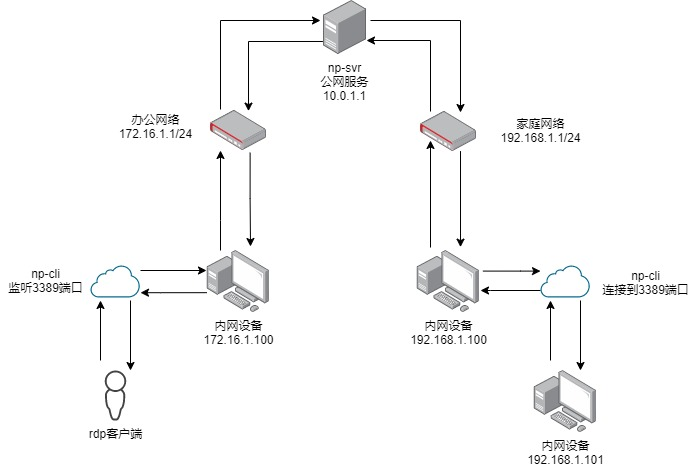

# natpass

NAT内网穿透工具

## 实现原理

基于tls链接，protobuf进行数据传输，下面举例在办公网络穿透到家庭网络，
并通过rdp进行连接家庭网络下的某台windows设备

server端配置(10.0.1.1)：

    listen: 6154       # 监听端口号
    secret: 0123456789 # 预共享密钥
    log:
      dir: /opt/natpass/logs # 路径
      size: 50M   # 单个文件大小
      rotate: 7   # 保留数量
    tls:
      key: /dir/to/tls/key/file # tls密钥
      crt: /dir/to/tls/crt/file # tls证书

家庭网络client配置(192.168.1.100)：

    id: home              # 客户端ID
    server: 10.0.1.1:6154 # 服务器地址
    secret: 0123456789    # 预共享密钥，必须与server端相同，否则握手失败
    log:
      dir: /opt/natpass/logs # 路径
      size: 50M   # 单个文件大小
      rotate: 7   # 保留数量

办公网络client配置(172.16.1.100)：

    id: work              # 客户端ID
    server: 10.0.1.1:6154 # 服务器地址
    secret: 0123456789    # 预共享密钥，必须与server端相同，否则握手失败
    log:
      dir: /opt/natpass/logs # 路径
      size: 50M   # 单个文件大小
      rotate: 7   # 保留数量
    tunnel:                         # 远端tunnel列表可为空
      - name: rdp                   # 链路名称
        target: home                # 目标客户端ID
        type: tcp                   # 连接类型tcp或udp
        local_addr: 0.0.0.0         # 本地监听地址
        local_port: 3389            # 本地监听端口号
        remote_addr: 192.168.1.101  # 目标客户端连接地址
        remote_port: 3389           # 目标客户端连接端口号

工作流程如下：

1. 办公网络与家庭网络中的np-cli创建tls连接到np-svr
2. np-cli服务发送握手包，并将配置文件中的secret字段进行md5哈希
3. np-svr等待握手报文，若等待超时则为非法链接，直接断开
4. 办公网络客户机创建新连接到172.16.1.100的3389端口
5. 172.16.1.100上的np-cli接收到新请求后创建新的link并生成链接id
6. 172.16.1.100上的np-cli发送connect_request消息，告知连接类型和链接目标地址和端口
7. np-svr转发connect_request消息至192.168.1.100上的np-cli
8. 192.168.1.100上的np-cli接收到connect_request消息，根据请求信息创建链接到目标地址和端口
9. 192.168.1.100上的np-cli根据链接创建结果返回connect_response消息
10. np-svr转发connect_response消息至172.16.1.100上的np-cli
11. 172.168.1.100上的np-cli接收到connect_response消息后根据是否成功来决定是否需要断开rdp客户端链接
12. 链路打通，两端各自发送data消息到对应链路

## 编译

    ./build

## 链接配置

    link:
      connections: 3    # 与server的连接数
      read_timeout: 1s  # 读取数据包超时时间
      write_timeout: 1s # 发送数据包超时时间

1. 只有client端可配置connections，client与server总是保持connections个链接
2. read_timeout和write_timeout为数据读写超时时间
  - 建议在server端设置较长的超时时间
  - 建议在client端设置较短的超时时间

## 部署

1. [下载](https://github.com/lwch/natpass/releases)并解压到任意目录
2. 修改配置文件
3. 注册服务

        sudo ./np-svr -conf <配置文件路径> -action install
        或
        sudo ./np-cli -conf <配置文件路径> -action install
4. 设置开机启动项

        sudo systemctl enable np-svr
        或
        sudo systemctl enable np-cli
5. 启动对应服务

        sudo /etc/init.d/np-svr start
        或
        sudo /etc/init.d/np-cli start

## iperf3压测对比

使用相同参数，iperf3压测1分钟

    # natpass10路复用，读写均为1s超时
    [ ID] Interval           Transfer     Bitrate         Retr
    [  5]   0.00-60.00  sec  70.0 MBytes  9.79 Mbits/sec   22             sender
    [  5]   0.00-60.02  sec  57.9 MBytes  8.10 Mbits/sec                  receiver

    # frp10路复用stcp，tls
    [ ID] Interval           Transfer     Bitrate         Retr
    [  5]   0.00-60.00  sec  66.2 MBytes  9.26 Mbits/sec   31             sender
    [  5]   0.00-60.10  sec  57.7 MBytes  8.05 Mbits/sec                  receiver