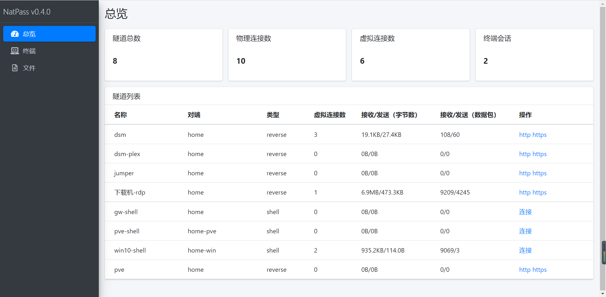
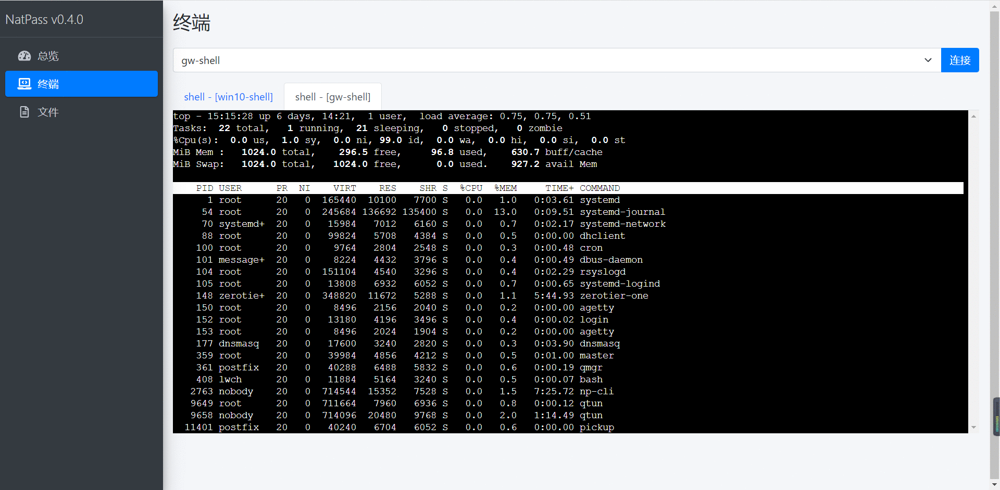
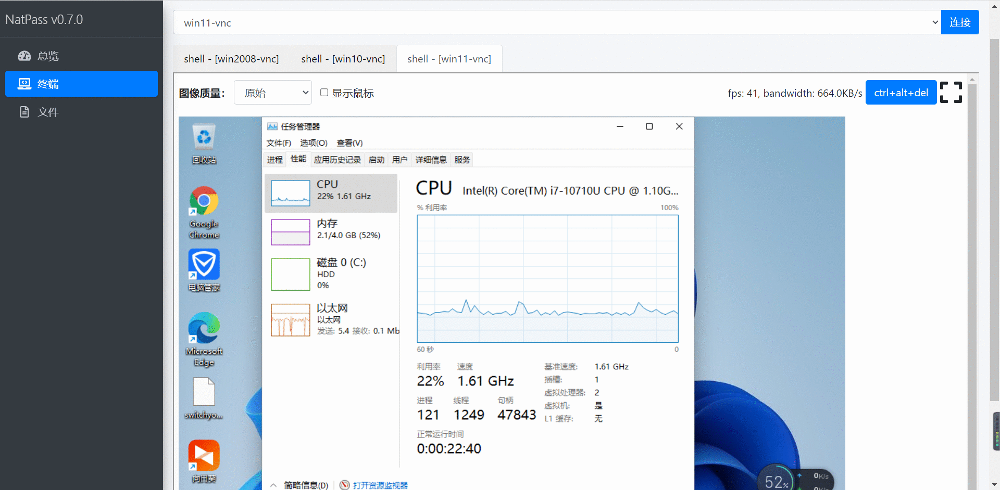
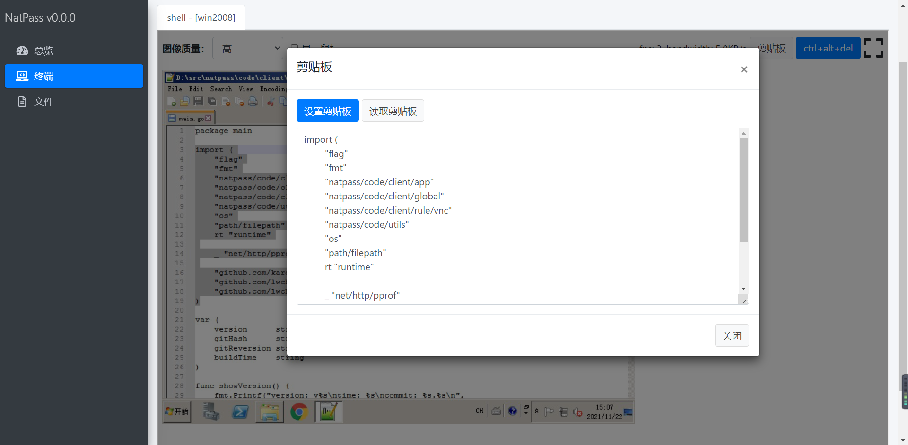
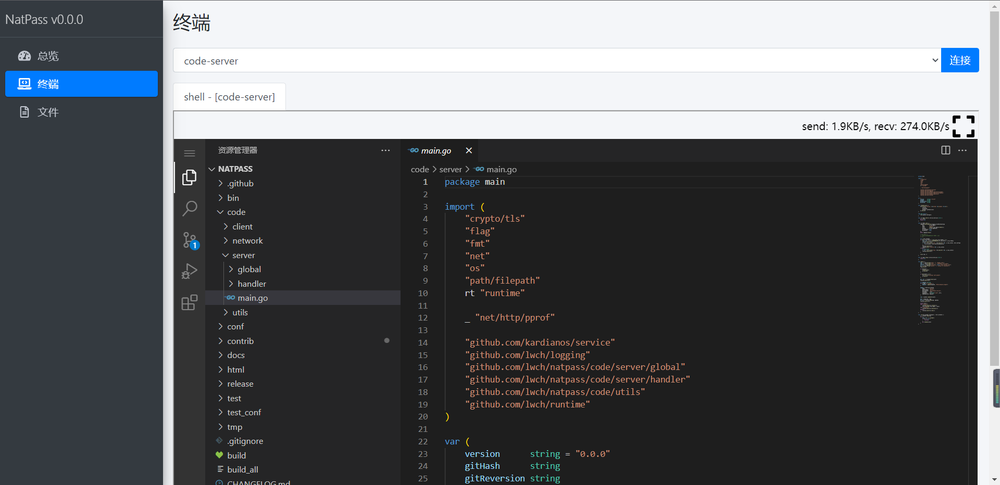
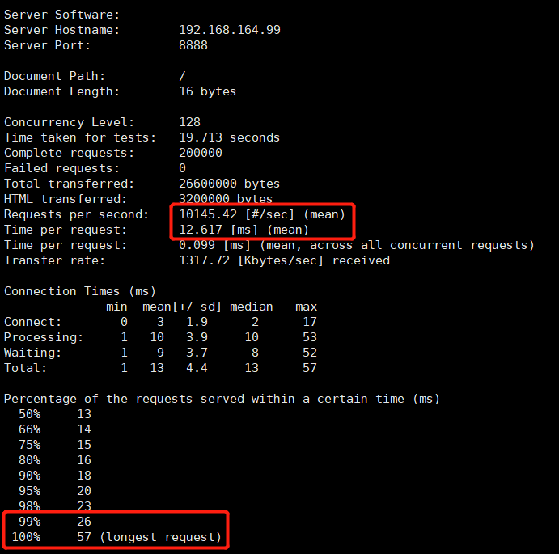

# natpass

新一代主机管理工具，支持shell管理，支持远程桌面管理[实现原理](docs/desc.md)

1. [如何部署](docs/startup.md)
2. [规则配置](docs/rules.md)
3. [开发文档](https://lwch.gitbook.io/natpass/dev)

功能与特性：

1. 支持私有化部署
2. 较小的内存占用（约20M左右）
3. 支持tls安全连接
4. 支持多路异步IO
5. 支持虚拟链路层
6. 支持链路和终端会话监控
7. protobuf数据编码
8. 支持web shell
   - linux和mac系统支持创建pty设备和颜色输出
   - windows系统支持powershell
9. 支持web vnc
   - 支持基本的键盘鼠标操作
   - 支持全屏显示
   - 支持滚动
   - 支持远程剪贴板设置与读取
10. 支持code-server
11. 支持多种操作系统
   - [x] linux
   - [x] windows
   - [x] macos

## 效果图

dashboard页面

命令行

| platform | 386 | amd64 | arm | arm64 |
| -------- | :-: | :---: | :-: | :---: |
| windows | ✅ | ✅ | ✅ | ✅ |
| macos   |    | ✅ |     | ✅ |
| linux   | ✅ | ✅ | ✅ | ✅ |

远程桌面

| platform | 386 | amd64 | arm | arm64 |
| -------- | :-: | :---: | :-: | :---: |
| windows | ✅ | ✅ | ❌ | ❌ |
| macos   |    | ✅ |    | ✅ |
| linux   | ✅ | ✅ | ❌ | ❌ |

windows剪贴板内容

code-server支持

## 性能

在vmware环境下创建4C2G（AMD Ryzen 7 4800U with Radeon Graphics）测试环境，并进行all in one部署server、remote端和local端，使用bench规则进行压测，结果如下：

1. 压测结果仅包含local端发起连接到remote端收到连接并返回成功的整个过程
2. 实验结果表明，在4C2G环境下可达到上万+的qps，且p99和p100均在60ms以下

## TODO

1. ~~支持include的yaml配置文件~~
2. ~~通用的connect、connect_response、disconnect消息~~
3. ~~dashboard页面~~
4. 文件传输
5. ~web远程桌面~
6. ~~流量监控统计页面，server还是client?~~
7. web端管理规则
8. 支持录屏

## 编译

1. 由于html/dashboard等目录下引用第三方库时使用软连接的方式进行处理，
   因此在windows环境下进行编译时需要将这些软连接的目录进行手工替换，
   第三方库的代码都在上级目录下可找到。

## stars

## 免责声明

本软件仅用于个人研究学习，包括但不限于以下条款：

1. 严禁用于黑客攻击、远程控制他人计算机等违法违规行为
2. 软件使用者使用该软件造成的任何损失均与软件作者无关，
   一切后果由使用者自己负责
3. 严禁用于一切商业用途，包括但不限于提供云桌面、云主机等

## 贡献代码

为了更好的发展，我们鼓励大家为natpass项目做出贡献及提出建议，项目的地址为[https://github.com/lwch/natpass](https://github.com/lwch/natpass)，因此在gitee上提交的pr将不被接受，请大家将pr提交到github的同名项目中。