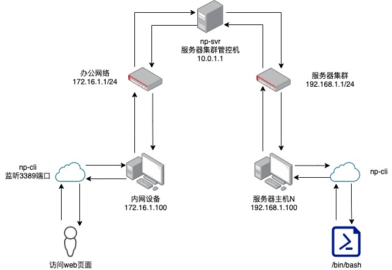
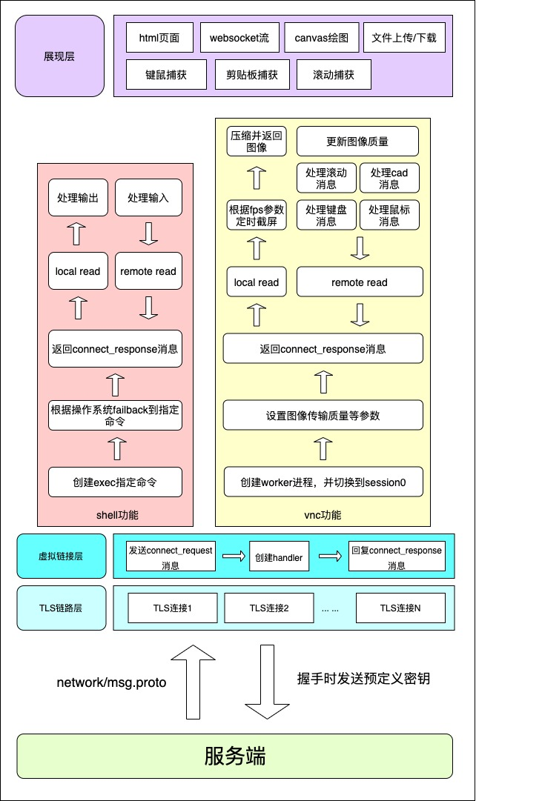

# 实现原理

支持tls链接，protobuf进行数据传输，下面举例远程连接服务器集群内的某台主机

server端配置(10.0.1.1)：

    listen: 6154       # 监听端口号
    secret: 0123456789 # 预共享密钥
    log:
      dir: /opt/natpass/logs # 路径
      size: 50M   # 单个文件大小
      rotate: 7   # 保留数量
    tls:
      key: /dir/to/tls/key/file # tls密钥
      crt: /dir/to/tls/crt/file # tls证书

服务器client配置(192.168.1.100)：

    id: server            # 客户端ID
    server: 10.0.1.1:6154 # 服务器地址
    secret: 0123456789    # 预共享密钥，必须与server端相同，否则握手失败
    log:
      dir: /opt/natpass/logs # 路径
      size: 50M   # 单个文件大小
      rotate: 7   # 保留数量

办公网络client配置(172.16.1.100)：

    id: work              # 客户端ID
    server: 10.0.1.1:6154 # 服务器地址
    secret: 0123456789    # 预共享密钥，必须与server端相同，否则握手失败
    log:
      dir: /opt/natpass/logs # 路径
      size: 50M   # 单个文件大小
      rotate: 7   # 保留数量
    rules:                          # 远端rule列表可为空
      - name: rdp                   # 链路名称
        target: server              # 目标客户端ID
        type: shell                 # 连接类型tcp或udp
        local_addr: 0.0.0.0         # 本地监听地址
        local_port: 3389            # 本地监听端口号

工作流程如下：

1. 办公网络与家庭网络中的np-cli创建tls连接到np-svr
2. np-cli服务发送握手包，并将配置文件中的secret字段进行md5哈希
3. np-svr等待握手报文，若等待超时则为非法链接，直接断开
4. 用户打开办公网络主机172.16.1.100上的终端页面，并连接到服务器集群中的主机server
5. 172.16.1.100上的np-cli发送connect_request消息，并将连接类型设置为shell
6. np-svr转发connect_request消息至192.168.1.100上的np-cli
7. 192.168.1.100上的np-cli接收到connect_request消息，创建/bin/bash进程
8. 192.168.1.100上的np-cli根据链接创建结果返回connect_response消息
9. np-svr转发connect_response消息至172.16.1.100上的np-cli
10. 172.168.1.100上的np-cli接收connect_response消息
11. 开始转发网页上的输入输出内容

## 软件架构

